# Music Ear Trainer

An interactive web-based ear training game that helps musicians develop their ability to identify musical intervals, chords, progressions, scales, and perfect pitch.


## Screenshots

<p align="center">
  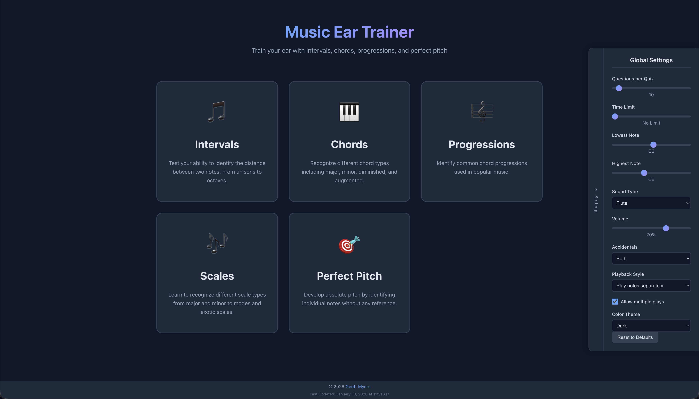
</p>

<p align="center">
  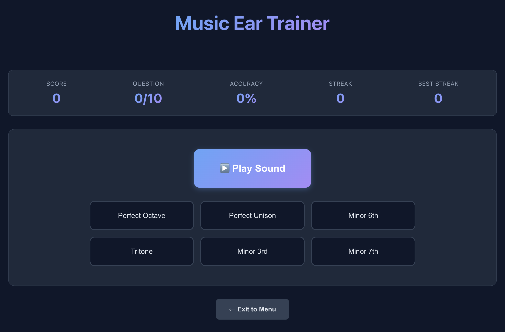
  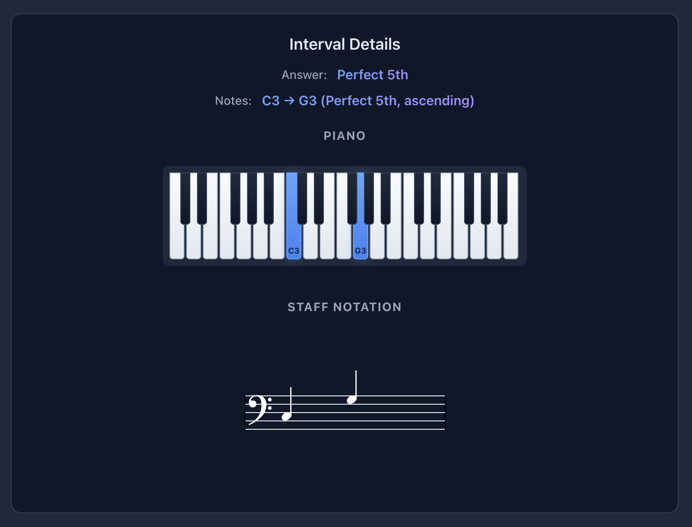
</p>

<p align="center">
  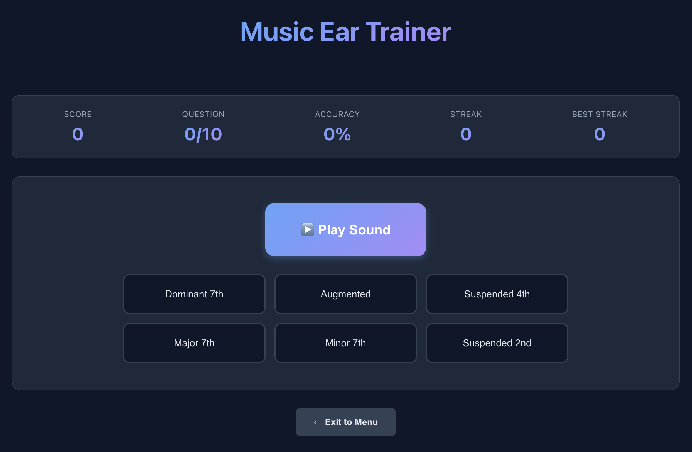
  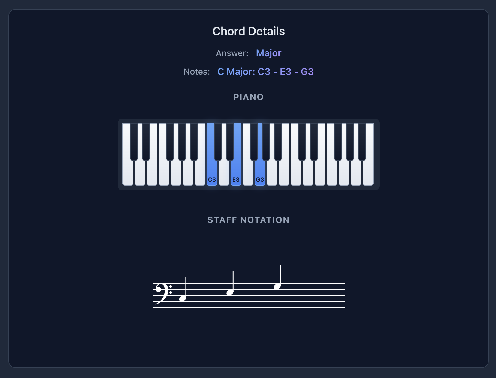
</p>

<p align="center">
  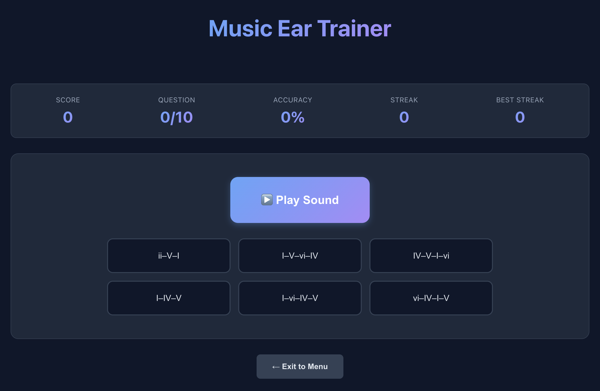
  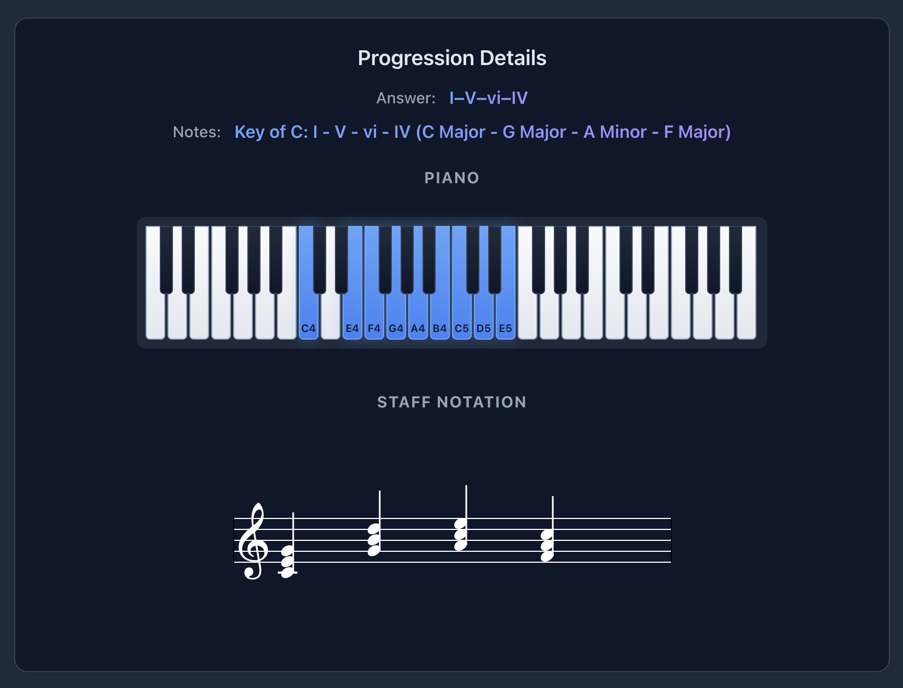
</p>

<p align="center">
  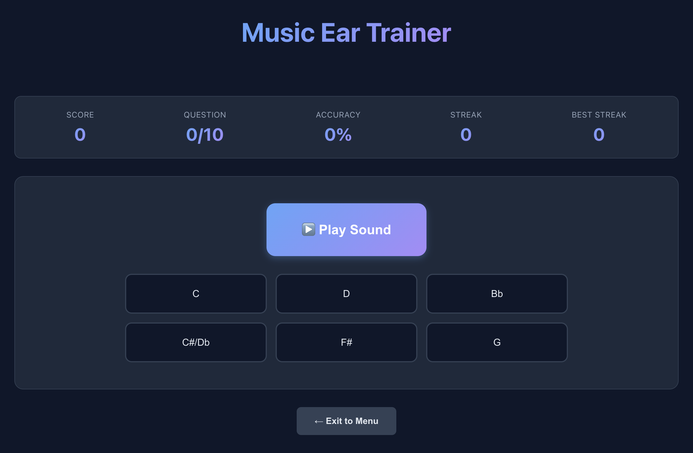
  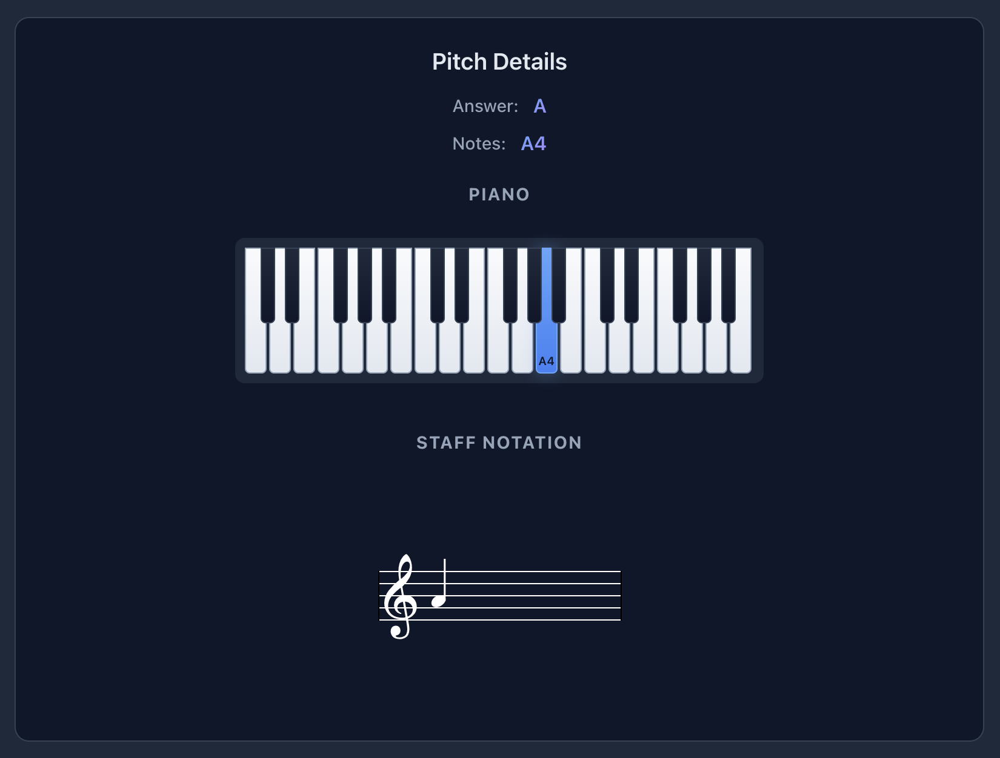
</p>

<p align="center">
  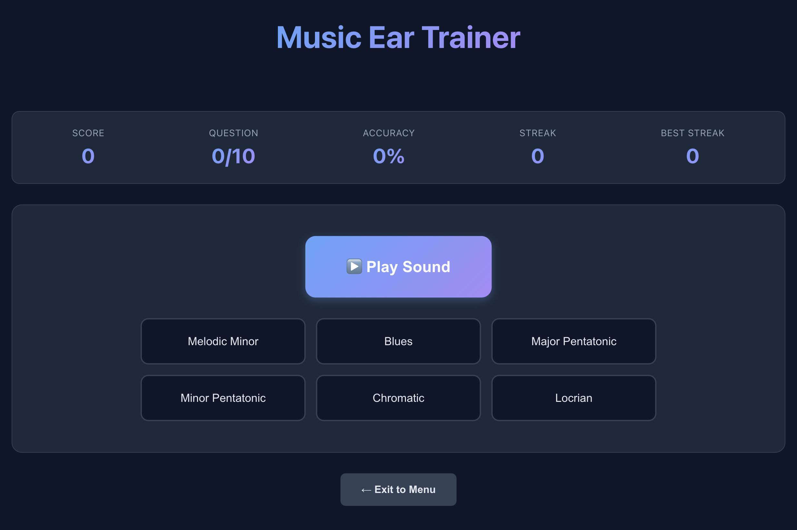
  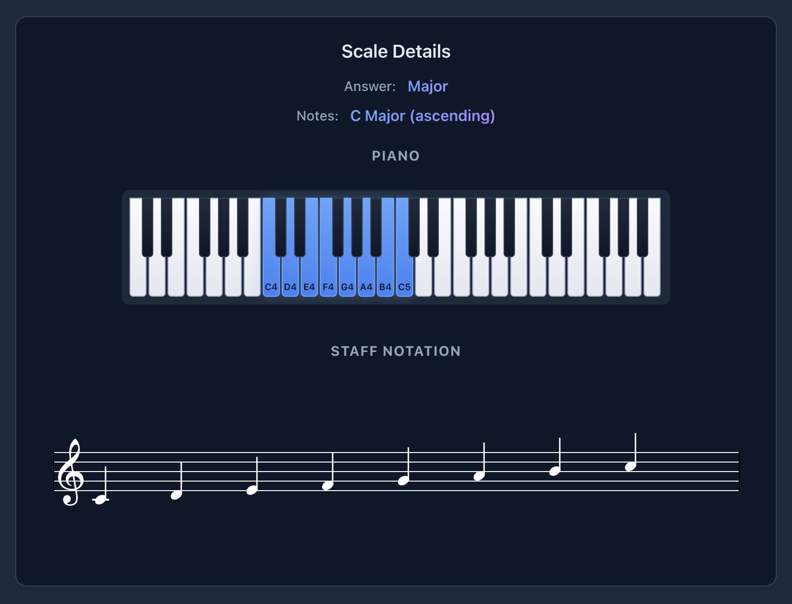
</p>

## 🎵 Features

### Game Modes

- **Intervals** - Identify the distance between two notes (unisons, seconds, thirds, fourths, fifths, sixths, sevenths, octaves)
- **Chords** - Recognize chord types (major, minor, diminished, augmented, 7th chords, etc.)
- **Progressions** - Identify common chord progressions (I-IV-V, vi-IV-I-V, ii-V-I, etc.)
- **Perfect Pitch** - Develop absolute pitch by identifying individual notes
- **Scales** - Recognize different scale types (major, minor, pentatonic, modes, etc.)

### Difficulty Levels

- **Easy** - Basic intervals, common chords, simple progressions
- **Medium** - Extended intervals, 7th chords, more complex progressions
- **Hard** - All intervals, advanced chords, jazz progressions, all scales

## 📚 Content Library

### Intervals (13 total)

**Easy (6):**

- Perfect Unison (P1) - 0 semitones
- Major 2nd (M2) - 2 semitones
- Major 3rd (M3) - 4 semitones
- Perfect 4th (P4) - 5 semitones
- Perfect 5th (P5) - 7 semitones
- Perfect Octave (P8) - 12 semitones

**Medium (4):**

- Minor 2nd (m2) - 1 semitone
- Minor 3rd (m3) - 3 semitones
- Major 6th (M6) - 9 semitones
- Major 7th (M7) - 11 semitones

**Hard (3):**

- Tritone (TT) - 6 semitones
- Minor 6th (m6) - 8 semitones
- Minor 7th (m7) - 10 semitones

### Chord Types (9 total)

**Easy (2):**

- Major - Root, Major 3rd, Perfect 5th
- Minor - Root, Minor 3rd, Perfect 5th

**Medium (2):**

- Diminished - Root, Minor 3rd, Diminished 5th
- Augmented - Root, Major 3rd, Augmented 5th

**Hard (5):**

- Major 7th - Root, Major 3rd, Perfect 5th, Major 7th
- Minor 7th - Root, Minor 3rd, Perfect 5th, Minor 7th
- Dominant 7th - Root, Major 3rd, Perfect 5th, Minor 7th
- Suspended 2nd - Root, Major 2nd, Perfect 5th
- Suspended 4th - Root, Perfect 4th, Perfect 5th

### Scale Types (14 total)

**Easy (4):**

- Major - W-W-H-W-W-W-H pattern
- Natural Minor - W-H-W-W-H-W-W pattern
- Major Pentatonic - 5-note scale
- Minor Pentatonic - 5-note scale

**Medium (4):**

- Harmonic Minor - Raised 7th degree
- Melodic Minor - Raised 6th and 7th degrees
- Dorian - Minor mode with raised 6th
- Mixolydian - Major mode with lowered 7th

**Hard (6):**

- Phrygian - Minor mode with lowered 2nd
- Lydian - Major mode with raised 4th
- Locrian - Diminished mode
- Blues - Blues scale with blue notes
- Whole Tone - All whole steps
- Chromatic - All 12 semitones

### Chord Progressions (8 total)

**Easy (3):**

- I–IV–V (Three chord progression)
- I–V–vi–IV (Pop progression)
- vi–IV–I–V (Axis progression)

**Medium (3):**

- I–vi–IV–V (50s progression)
- IV–V–I–vi (Circle progression)
- I–IV–vi–V (Singer-songwriter)

**Hard (2):**

- ii–V–I (Jazz progression)
- I–iii–vi–IV (Sensitive female chord progression)

**Total Content:** 44 unique music theory elements across all game modes

_Note: Difficulty levels are cumulative - Medium includes all Easy content, and Hard includes all Easy + Medium content._

### Visual Learning Tools

- **Piano Keyboard** - See notes highlighted on a virtual piano
- **Music Staff Notation** - View notes on traditional staff notation using VexFlow
- **Answer Feedback** - Immediate visual and text feedback on your answers

### Audio Features

- **Multiple Sound Types** - Choose from sine, square, sawtooth, triangle waveforms or realistic instrument sounds
- **Instrument Library** - Piano, guitar, violin, flute, trumpet samples using Tone.js
- **Playback Modes** - Play notes separately, together, or arpeggio style
- **Volume Control** - Adjustable volume with visual slider

### Customization

- **Adjustable Range** - Set the lowest and highest notes for questions
- **Questions Per Quiz** - Configure how many questions per session (5-100)
- **Time Limits** - Optional time limits per question
- **Accidentals** - Choose sharps, flats, both, or naturals only
- **Theme** - Dark and light mode support

### Progress Tracking

- **Score Tracking** - Real-time score display with percentage accuracy
- **Streak Counter** - Track your current and best answer streaks
- **Statistics** - Per-mode statistics (total questions, correct answers, accuracy)
- **Local Storage** - Your stats persist between sessions

## 🚀 Getting Started

### Prerequisites

- Node.js 18.x or higher
- npm or yarn package manager

### Installation

1. Clone the repository:

```bash
git clone https://github.com/geoffmyers/music-ear-trainer.git
cd music-ear-trainer
```

2. Install dependencies:

```bash
npm install
```

3. Run the development server:

```bash
npm run dev
```

4. Open [http://localhost:3000](http://localhost:3000) in your browser

### Building for Production

```bash
# Create optimized production build
npm run build

# Preview the production build
npm run start
```

### Deployment to Cloudflare Workers

The app is deployed to Cloudflare Workers at **https://music-ear-trainer.geoffmyers.com/**

```bash
# Deploy to Cloudflare Workers
npm run deploy
```

The app will be exported as a static site and deployed to Cloudflare Workers.

## 🎮 How to Play

1. **Select a Game Mode** - Choose from Intervals, Chords, Progressions, Perfect Pitch, or Scales
2. **Choose Difficulty** - Select Easy, Medium, or Hard based on your skill level
3. **Adjust Settings** - Customize the experience using the Settings panel (click the toggle on the right)
4. **Play Sound** - Click the "Play Sound" button to hear the musical question
5. **Select Answer** - Choose from the multiple-choice options
6. **Get Feedback** - See if you're correct and view the visualization
7. **Continue** - Click "Next Question" to continue practicing

## 🏗️ Project Structure

```
music-ear-trainer/
├── app/
│   ├── components/          # React components
│   │   ├── AnswerVisualization.tsx
│   │   ├── Confetti.tsx
│   │   ├── DifficultySelector.tsx
│   │   ├── FeedbackDisplay.tsx
│   │   ├── Footer.tsx
│   │   ├── GameModeSelector.tsx
│   │   ├── Header.tsx
│   │   ├── MusicStaff.tsx
│   │   ├── PianoKeyboard.tsx
│   │   ├── QuizInterface.tsx
│   │   ├── ResultsScreen.tsx
│   │   ├── ScoreDisplay.tsx
│   │   └── SettingsPanel.tsx
│   ├── globals.css          # Global styles
│   ├── layout.tsx           # Root layout
│   └── page.tsx             # Main game page
├── lib/
│   ├── audio/               # Audio generation
│   │   ├── AudioEngine.ts
│   │   ├── chordGenerator.ts
│   │   ├── InstrumentLoader.ts
│   │   ├── intervalGenerator.ts
│   │   ├── pitchGenerator.ts
│   │   ├── progressionGenerator.ts
│   │   └── scaleGenerator.ts
│   ├── context/             # React context
│   │   └── GlobalSettingsContext.tsx
│   ├── game/                # Game logic
│   │   ├── difficultyConfig.ts
│   │   ├── localStorage.ts
│   │   ├── quizEngine.ts
│   │   └── scoreManager.ts
│   ├── music/               # Music theory
│   │   ├── chords.ts
│   │   ├── intervals.ts
│   │   ├── noteFrequencies.ts
│   │   ├── pitches.ts
│   │   ├── progressions.ts
│   │   └── scales.ts
│   └── types/               # TypeScript types
│       ├── audio.ts
│       ├── game.ts
│       ├── music.ts
│       └── settings.ts
├── public/                  # Static assets
│   ├── favicon.ico
│   └── instruments/         # Instrument samples
├── next.config.mjs          # Next.js configuration
├── package.json             # Dependencies
└── tsconfig.json            # TypeScript configuration
```

## ⚙️ Configuration

### Global Settings

Access the settings panel by clicking the "Settings" toggle on the right side of the screen:

- **Questions per Quiz** - Set how many questions per session
- **Time Limit** - Optional time limit per question (5s-60s or no limit)
- **Lowest Note** - Set the lowest note that can appear
- **Highest Note** - Set the highest note that can appear
- **Sound Type** - Choose waveform or instrument sound
- **Volume** - Adjust playback volume
- **Accidentals** - Choose how sharps/flats appear
- **Playback Style** - Play notes separately or together
- **Allow Multiple Plays** - Enable/disable replay button
- **Color Theme** - Switch between dark and light mode

### Environment Variables

No environment variables are required for this application.

## 🛠️ Technology Stack

- **Framework** - [Next.js 15](https://nextjs.org/) (React 19, App Router)
- **Language** - [TypeScript 5](https://www.typescriptlang.org/)
- **Audio** - [Tone.js](https://tonejs.github.io/) for audio synthesis and instrument samples
- **Music Notation** - [VexFlow](https://www.vexflow.com/) for rendering music staff notation
- **Styling** - CSS Variables with responsive design
- **Deployment** - [Cloudflare Workers](https://workers.cloudflare.com/) (static export)
- **State Management** - React Context API for global settings
- **Storage** - Browser localStorage for statistics persistence

## 🧪 Development

### Code Quality

- TypeScript strict mode enabled
- Component-based architecture
- Custom hooks for game logic
- Comprehensive type definitions

### Performance Optimizations

- Static site generation (SSG)
- Client-side only audio synthesis
- Lazy loading of instrument samples
- Efficient state management

## 📝 License

GPL-2.0 License - See [LICENSE.md](LICENSE.md) for details.

## 🙏 Acknowledgments

- [Tone.js](https://tonejs.github.io/) for audio synthesis
- [VexFlow](https://www.vexflow.com/) for music notation rendering
- [Next.js](https://nextjs.org/) for the framework
- Music theory based on standard Western music notation

## 📧 Contact

For questions or feedback, please visit [geoffmyers.com](https://www.geoffmyers.com)

---

Built with ❤️ using Next.js, React, and TypeScript
