<p align="center">
  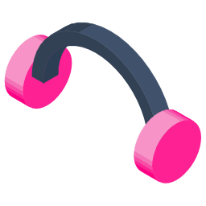
</p>

# Music Ear Trainer

<!-- BADGES:START -->


[](LICENSE.md)
[](CONTRIBUTING.md)
<!-- BADGES:END -->

## Description

An ear-training game for musicians. It plays an interval, a chord, a chord
progression, a scale or a single note, and you name what you heard. Each answer
is then shown on a piano keyboard and in staff notation, so you can see what
you heard as well as hear it.

**Play it at [music-ear-trainer.geoffmyers.com](https://music-ear-trainer.geoffmyers.com/).**
It is a static Next.js site, and the same code is packaged for iOS and Android
with Capacitor.

## Table of Contents

- [Description](#description)
- [Screenshots](#screenshots)
- [Features](#features)
  - [Content library](#content-library)
- [Requirements](#requirements)
- [Installation](#installation)
- [Usage](#usage)
  - [How to play](#how-to-play)
  - [Settings](#settings)
  - [Building and deploying](#building-and-deploying)
  - [Mobile apps](#mobile-apps)
- [Architecture](#architecture)
- [Credits](#credits)
- [Contributing](#contributing)
- [License](#license)

## Screenshots

<p align="center">
  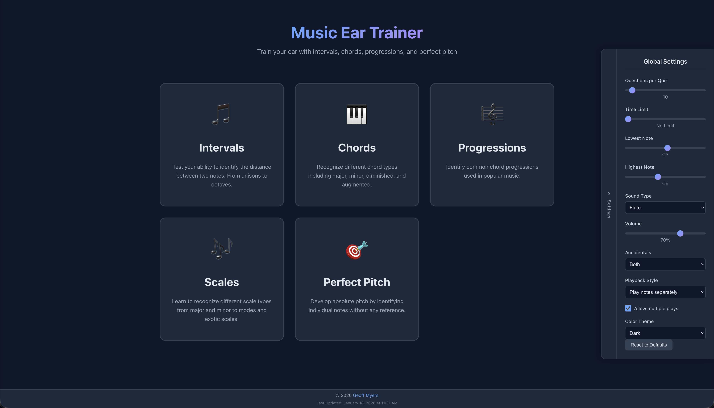
</p>

| Question | Answer |
|---|---|
| 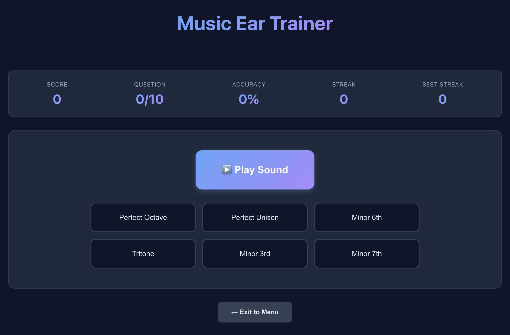 | 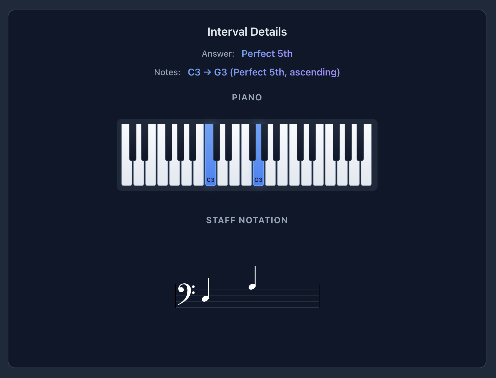 |
| 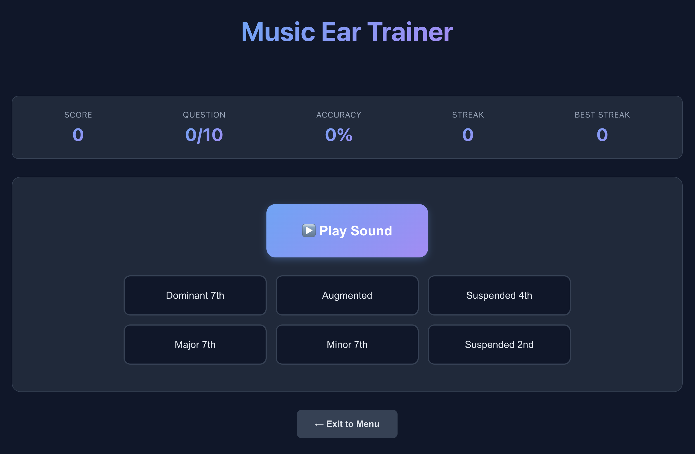 | 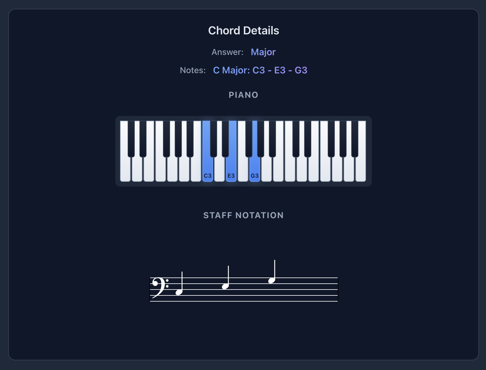 |
| 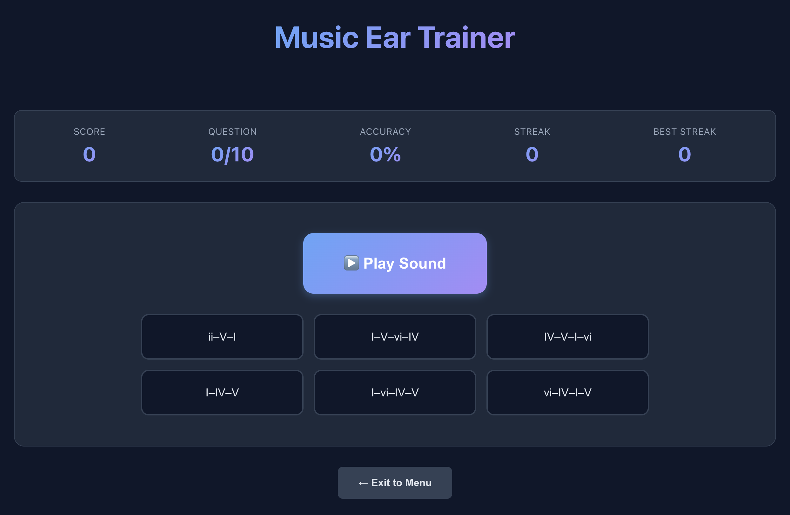 | 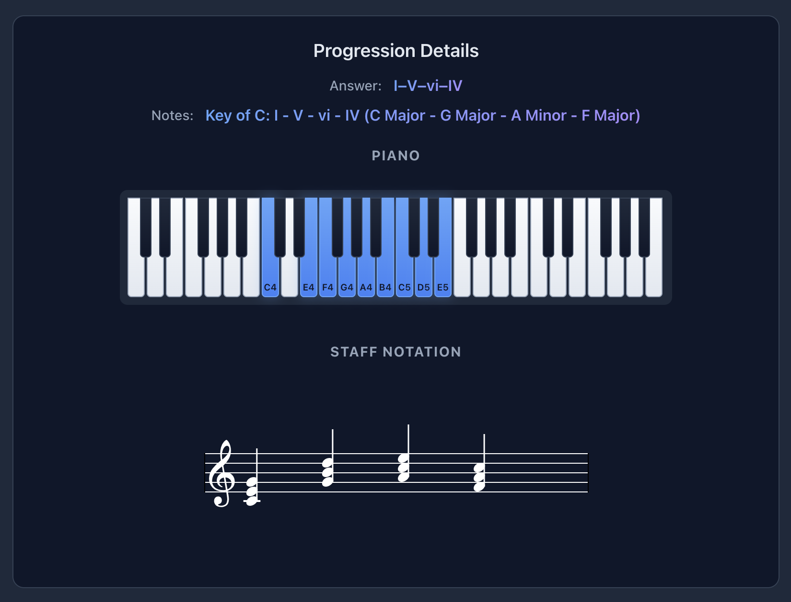 |
| 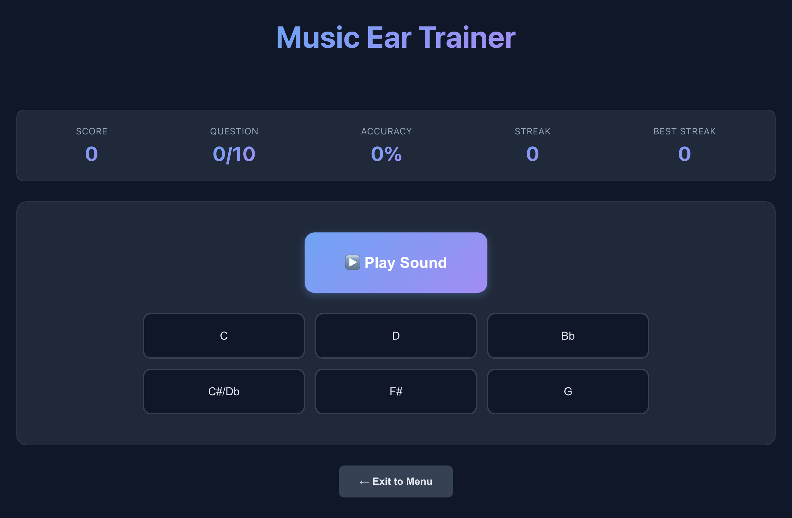 | 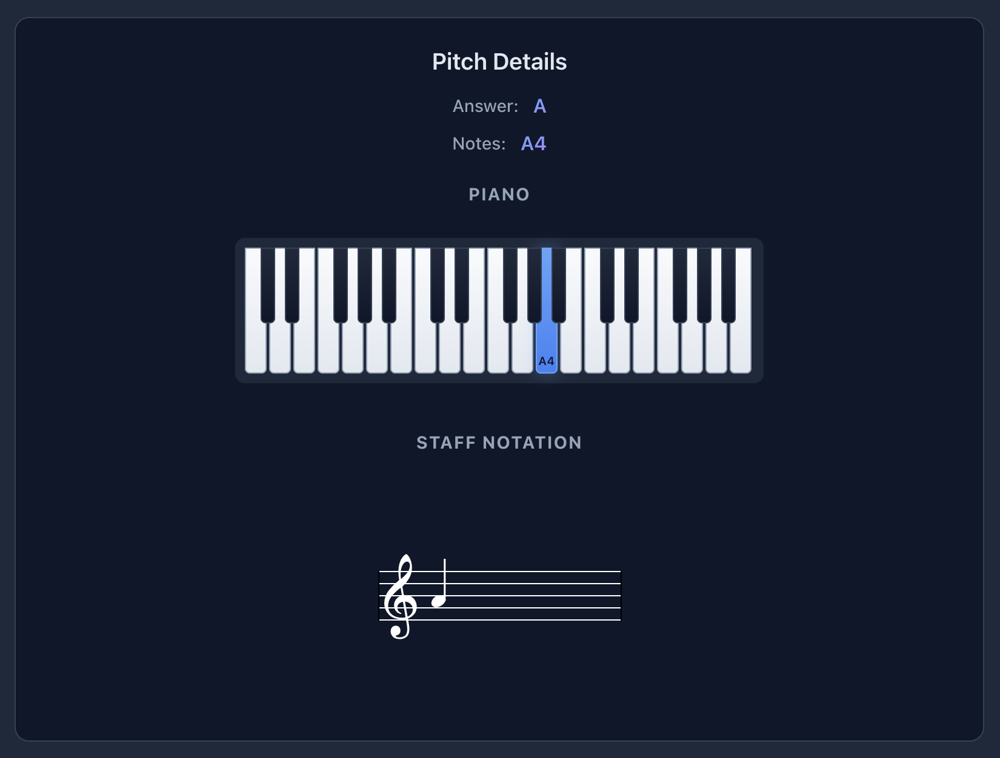 |
| 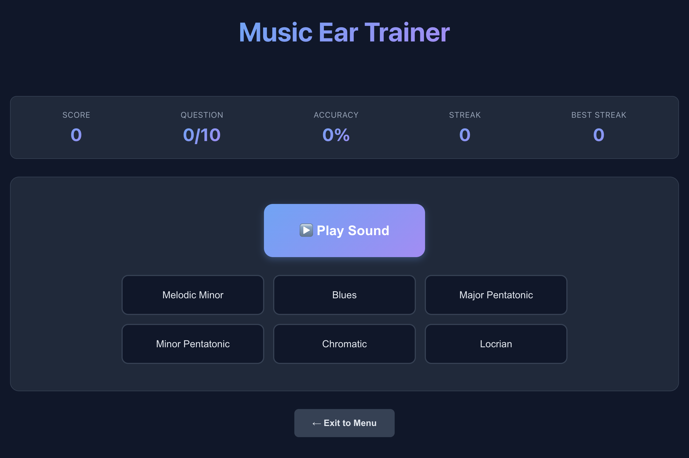 | 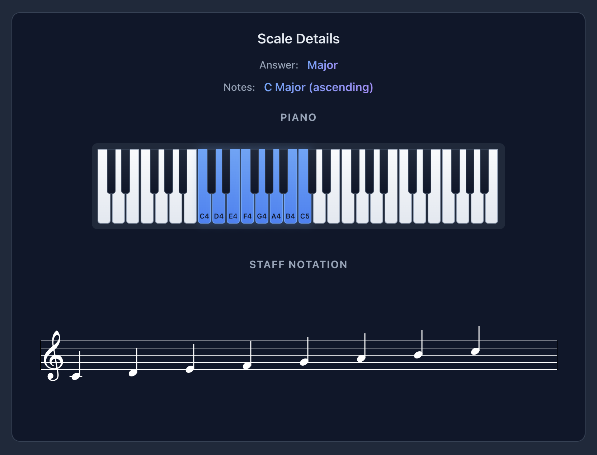 |

## Features

- **Five game modes**: intervals, chords, chord progressions, scales and
  perfect pitch
- **Three difficulty levels.** Each level adds material and answer choices:
  3 choices on Easy, 4 on Medium and 6 on Hard.
- **Answers you can see**: a highlighted piano keyboard and staff notation
  rendered with VexFlow
- **Real and synthesised sound**: sine, square, sawtooth and triangle waves, or
  sampled piano, acoustic guitar, violin, flute and trumpet
- **Adjustable practice**: note range, number of questions (5–100), an optional
  time limit per question, sharps or flats, and notes played one after another
  or together
- **Scoring with streaks**: points per correct answer grow with the difficulty,
  a streak bonus is added every three in a row, and statistics are kept per mode
- **Dark and light themes**
- **No server or account**: it is a static site, and your settings and
  statistics are kept in the browser
- **iOS and Android apps** built with Capacitor, with haptic feedback on phones

### Content library

56 items across the five modes. The difficulty levels are cumulative: Medium
includes everything in Easy, and Hard includes everything.

| Mode | Easy | Medium adds | Hard adds |
|---|---|---|---|
| **Intervals** (13) | Unison, major 2nd, major 3rd, perfect 4th, perfect 5th, octave | Minor 2nd, minor 3rd, major 6th, major 7th | Tritone, minor 6th, minor 7th |
| **Chords** (9) | Major, minor | Diminished, augmented | Major 7th, minor 7th, dominant 7th, sus2, sus4 |
| **Scales** (14) | Major, natural minor, major pentatonic, minor pentatonic | Harmonic minor, melodic minor, Dorian, Mixolydian | Phrygian, Lydian, Locrian, blues, whole tone, chromatic |
| **Progressions** (8) | I–IV–V, I–V–vi–IV, vi–IV–I–V | I–vi–IV–V, IV–V–I–vi, I–IV–vi–V | ii–V–I, I–iii–vi–IV |
| **Perfect pitch** (12) | C, D, E, F, G, A, B | B♭, E♭, F♯ | C♯/D♭, G♯/A♭ |

Questions are played within the note range set in the settings.

## Requirements

- **Node.js 20.9** or newer (required by Next.js 16) and npm
- A browser with the Web Audio API
- For the mobile apps: **Node.js 22** or newer (required by the Capacitor 8
  CLI), plus **Xcode** on a Mac for iOS or **Android Studio** for Android
- To deploy: a Cloudflare account and the Wrangler CLI, which is installed as a
  dev dependency

## Installation

```bash
git clone https://github.com/geoffmyers/music-ear-trainer.git
cd music-ear-trainer
npm install
npm run dev
```

Open [http://localhost:3000](http://localhost:3000). No environment variables
are needed.

## Usage

### How to play

1. **Choose a mode**: Intervals, Chords, Progressions, Perfect Pitch or Scales.
2. **Choose a difficulty**: Easy, Medium or Hard.
3. **Adjust the settings** if you like, from the panel on the right.
4. **Press ▶️ Play Sound** to hear the question.
5. **Pick an answer** from the choices.
6. **Read the feedback**: whether you were right, with the answer shown on the
   keyboard and the staff.
7. **Press Next Question** to carry on. A results screen follows the last
   question.

Audio starts only after you interact with the page, as browsers require.

### Settings

| Setting | Options |
|---|---|
| Questions per Quiz | 5 to 100 |
| Time Limit | None, or 5, 10, 15, 20, 30, 45 or 60 seconds |
| Lowest Note, Highest Note | The range questions are drawn from |
| Sound Type | A waveform or a sampled instrument |
| Volume | 0 to 100% |
| Accidentals | Sharps, flats, both, or naturals only |
| Playback Style | Notes played separately or together |
| Allow multiple plays | Whether the question can be replayed |
| Color Theme | Dark or light |

Settings and statistics are saved in the browser's local storage.

### Building and deploying

```bash
npm run build          # static export to out/
npx serve out          # preview the export locally
```

`npm run start` does not work for this project: Next.js's `next start` refuses
to serve a static export.

The live site is a [Cloudflare Worker with static assets](https://developers.cloudflare.com/workers/static-assets/)
serving `out/`. To deploy your own copy, change `account_id` in
`wrangler.toml` to your Cloudflare account, then:

```bash
npm run deploy         # next build && wrangler deploy
```

### Mobile apps

The `ios/` and `android/` projects wrap the same static build with Capacitor.

```bash
npm run cap:ios          # build, sync, and open the project in Xcode
npm run cap:android      # build, sync, and open the project in Android Studio
npm run cap:run:ios      # build, sync, and run on a device or simulator
npm run cap:run:android
```

## Architecture

A single-page Next.js app exported as static files. There are no server routes;
everything runs in the browser, and navigation between screens is React state
rather than URLs.

```
page.tsx ─► GameModeSelector ─► DifficultySelector ─► QuizInterface ─► ResultsScreen
                                                          │
                          quizEngine ◄─ lib/music + data/  │  AnswerVisualization
                          AudioEngine (Tone.js) ◄─────────┘   ├─ PianoKeyboard
                                                              └─ MusicStaff (VexFlow)
```

| Path | Role |
|---|---|
| `app/page.tsx` | The game flow: mode, difficulty, quiz, results |
| `app/components/` | Screens, the settings footer, piano keyboard, staff notation and confetti |
| `lib/audio/` | `AudioEngine` (Tone.js), sample loading, and a generator per mode |
| `lib/music/` | Intervals, chords, scales, progressions and note maths |
| `data/` | The intervals, chords, scales and progressions as JSON |
| `lib/game/` | Question generation, difficulty settings, scoring and saved statistics |
| `lib/context/` | Global settings, persisted to local storage |
| `public/samples/` | Instrument samples and their credits |
| `ios/`, `android/`, `capacitor.config.ts` | The Capacitor mobile projects |
| `wrangler.toml` | The Cloudflare deployment |

See [ARCHITECTURE.md](ARCHITECTURE.md) for more detail.

## Credits

- Audio synthesis and scheduling by [Tone.js](https://tonejs.github.io/); staff
  notation by [VexFlow](https://www.vexflow.com/).
- Built with [Next.js](https://nextjs.org/) and [React](https://react.dev/),
  packaged for mobile with [Capacitor](https://capacitorjs.com/), and deployed
  with [Wrangler](https://developers.cloudflare.com/workers/wrangler/).
- Instrument samples from
  [tonejs-instruments](https://github.com/nbrosowsky/tonejs-instruments) by
  Nicholaus Brosowsky, used under
  [CC BY 3.0](https://creativecommons.org/licenses/by/3.0/). See
  [public/samples/2026-08-14-sample-credits.md](public/samples/2026-08-14-sample-credits.md).

Written by Geoff Myers ([geoffmyers.com](https://www.geoffmyers.com)).

## Contributing

Bug reports and pull requests are welcome. See [CONTRIBUTING.md](CONTRIBUTING.md)
for setup, checks and how this repository is published.

## License

Copyright © 2026 Geoff Myers

This program is free software: you can redistribute it and/or modify it under
the terms of the GNU General Public License as published by the Free Software
Foundation, either version 3 of the License, or (at your option) any later
version.

This program is distributed in the hope that it will be useful, but WITHOUT ANY
WARRANTY; without even the implied warranty of MERCHANTABILITY or FITNESS FOR A
PARTICULAR PURPOSE. See [LICENSE.md](LICENSE.md) for the full text of the GNU
General Public License.

SPDX-License-Identifier: `GPL-3.0-or-later`
